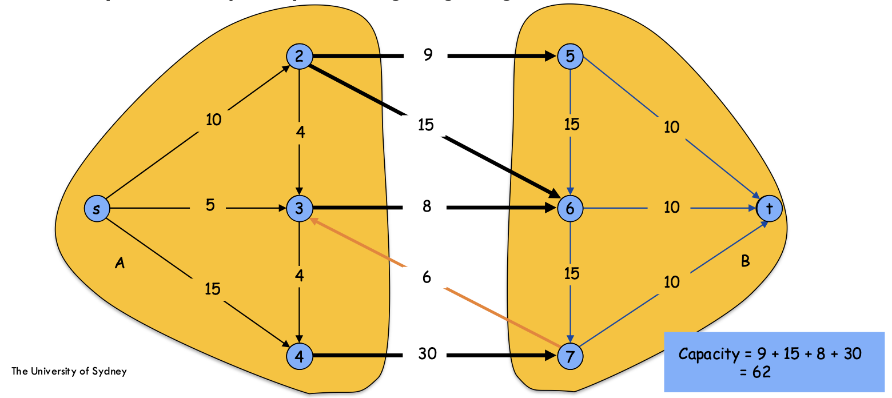
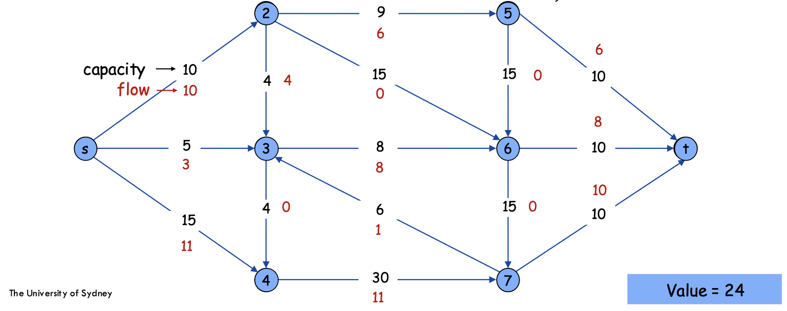
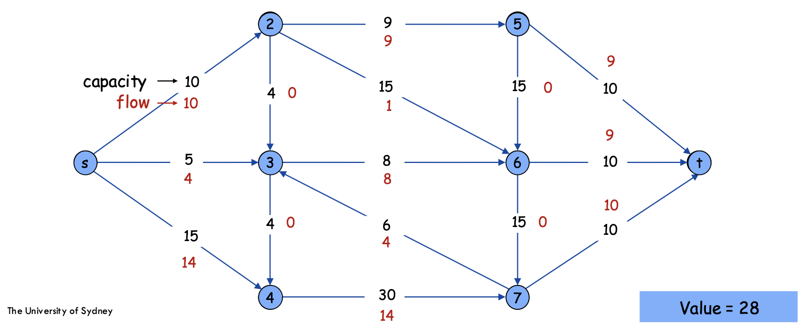
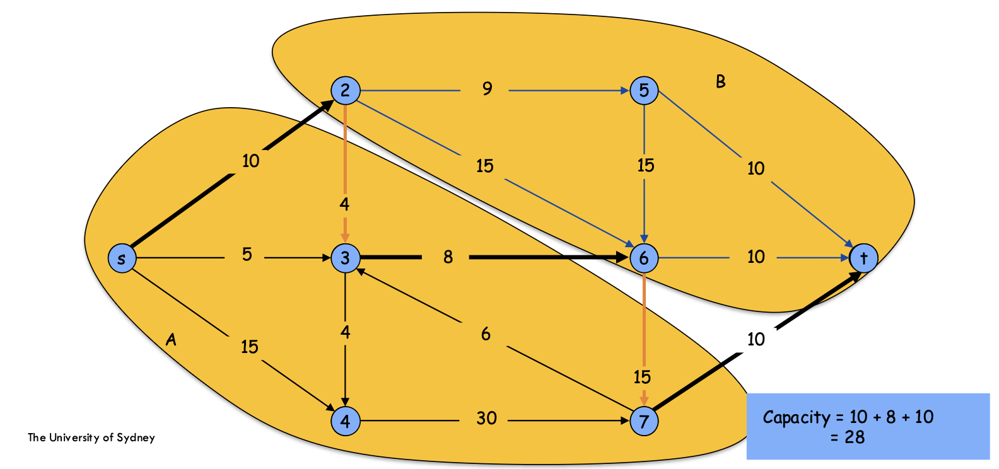
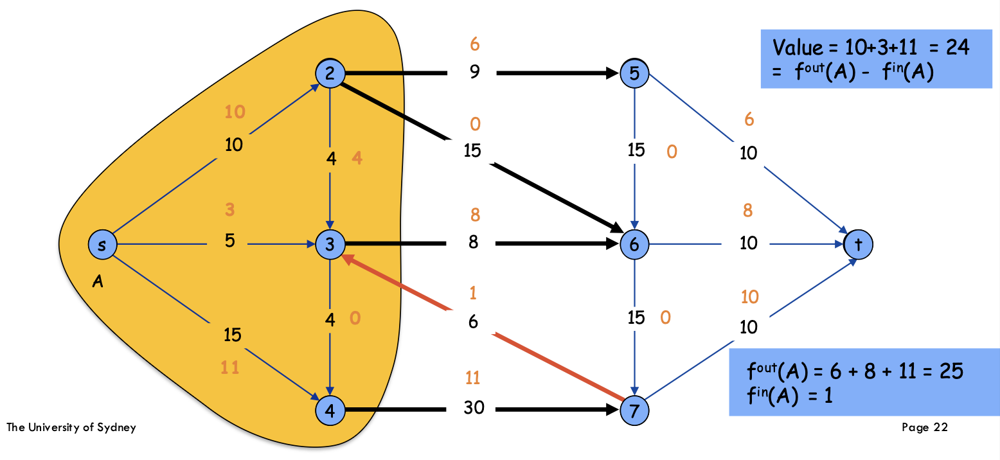
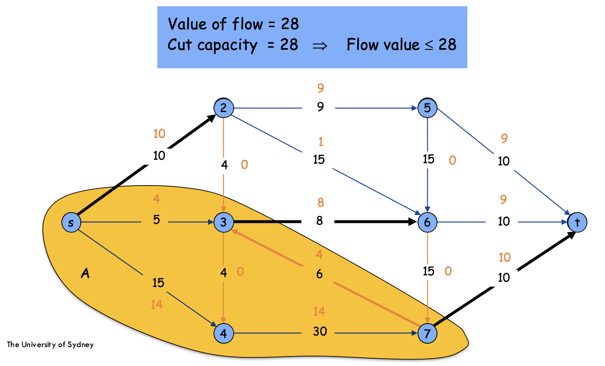
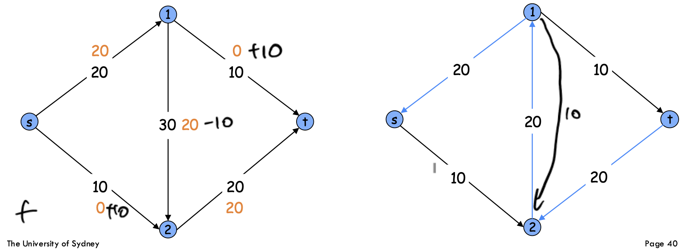
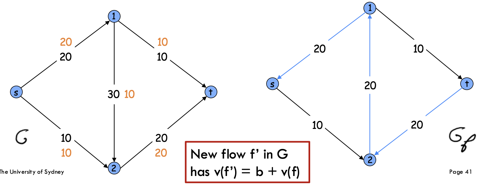

# Part I. Flow Networks and Max Flow
## 1. Flow Network
A **flow network** is a directed graph $G=(V,E)$ with:
* a distinguished **source** vertex $s$,
* a distinguished **sink** vertex $t$,
* each edge $e\in E$ has a non-negative capacity $c(e)\ge0$,
* usually assume no parallel edges,
* source $s$ $s$ has no incoming edges,
* sink $t$ has no outgoing edges.

Interpretation:
* capacity $c(e)$: maximum amount that edge can carry;
* float $f$: actual amount sent through edge.



## 2. s-t Flow
An **s-t flow** is a function $f:E\to[0,\infty)$ satisfying two constraints.

### 2.1 Capacity Constraint
For every edge $e\in E$, $0\le f(e)\le c(e)$. 

If $f(e)=c(e)$, then the edge $e$ is **saturated**.

Meaning:
* flow cannot be negative;
flow cannot exceed capacity.


### 2.2 Flow Conservation
For every vertex $v\in V\setminus\{s,t\}$, the total flow entering $v$ equals the total flow leaving $v$:

$$
\sum_{\text{e into v}}f(e)=\sum_{\text{e out of v}}f(e),
$$
i.e. every intermediate node is neither creating nor destroying flow.

Source $s$ is allowed to create flow. Sink $t$ is allowed to absorb flow.

### 2.3 Value of a Flow
The value of a flow $f$, denoted $v(f)$, is the total flow leaving the source:

$$
v(f)=\sum_{\text{e out of s}}f(e).
$$

Because of conservation, this is also equal to the net amount eventually reaching $t$.



## 3. Maximum Flow Problem
The **maximum flow problem**: Given a flow network $G=(V,E)$, source $s$, sink $t$, and capacities $c(e)$, find an s-t flow $f$ of maximum value.

Formally, find

$$
f^*=\underset{f}{\text{argmax }}v(f)
$$

subject to:
* $0\le f(e)\le c(e)$ (capacity constraint)
* $\sum_{\text{e into v}}f(e)=\sum_{\text{e out of v}}f(e)$ at all $v\notin\{s,t\}$ (flow conservation)

This is a special case of linear programming, but COMP3027 focuses on combinatorial algorithms e.g. Ford-Fulkerson. 



# Part II. Cuts and Weak Duality
## 4. s-t Cut
An **s-t cut** is a partition $A,B\subseteq V$ such that:
* $s\in A$,
* $t\in B$,
* $A\cup B=V$,
* $A\cap B=\emptyset$.

Intuition:
* $A$: source side
* $B$: sink side
* every path from $s$ to $t$ must cross from $A$ to $B$ at least once

## 5. Capacity of a Cut
The capacity of cut $(A,B)$ is

$$
\text{cap}(A,B)=\sum_{\text{e out of A}}c(e).
$$

IMPORTANT: Only count directed edges going from $B$ to $A$.

This is crucial. A cut is not counting all edges crossing the partition; it only counts outgoing edges from the $s$-side.



## 6. Minimum Cut Problem
The **minimum s-t cut problem**: Find an s-t cut $(A,B)$ of minimum capacity.

Formally, find:

$$
(A^*,B^*)=\underset{(A,B)}{\text{argmin}}\text{ cap}(A,B).
$$

In the figure: 
* `max_flow = 28`
* `min_cut = 28`

This is not a coincidence, it is exactly the **max-flow min-cut theorem**.

## 7. Flow across a Cut
For a vertex subset $S\subseteq V$, define:

$$
f^{out}(S)=\sum_{\text{e leaving S}}f(e),\quad f^{in}(S)=\sum_{\text{e entering S}}f(e).
$$

For a single vertex $u$, similarly:

$$
f^{out}(u)=\sum_{\text{e leaving u}}f(e),\quad f^{in}(u)=\sum_{\text{e entering u}}f(e).
$$

For intermediate vertices $v\notin\{s,t\}$,

$$
f^{in}(v)=f^{out}(v).
$$

## 8. Flow Value Lemma

**Lemma (Flow Value Lemma).** Let $f$ be any s-t flow, and let $(A,B)$ be any s-t cut. Then

$$
v(f)=f^{out}(A)-f^{in}(A).
$$

Meaning: The value of the flow equals the net flow crossing the cut from $A$ to $B$.

*Proof.* Start with $f^{out}(A)-f^{in}(A)$. This equals the sum of net outgoing flow over all vertices in $A$:

$$
f^{out}(A)-f^{in}(A)=\sum_{v\in A}\big(f^{out}(v)-f^{in}(v)\big).
$$

Why? Internal edges inside $A$ cancel out: an edge inside $A$ is outgoing from one vertex but incoming to another.

Since $s\in A$, and all other non-source vertices in $A$ satisfy flow conservation,

$$
f^{out}(v)-f^{in}(v)=0\quad\text{for $v\notin\{s,t\}$}.
$$

Also $t\notin A$. Therefore only $s$ contributes:

$$
\sum_{v\in A}\big(f^{out}(v)-f^{in}(v)\big)=f^{out}(s)-f^{in}(s).
$$

Since source $s$ has no incoming edges, $f^{in}(s)=0$. Thus

$$
f^{out}(A)-f^{in}(A)=f^{out}(s)=v(f).
$$

So,

$$
v(f)=f^{out}(A)-f^{in}(A).
$$



## 9. Weak Duality: Max Flow $\le$ Min Cut
**THeorem (Weak Duality).** For any flow $f$ and any s-t cut $(A,B)$,

$$
v(f)\le\text{cap}(A,B).
$$

Therefore, 

$$
\text{maximum flow value}\le\text{minimum cut capacity}.
$$

*Proof.* By Flow Value Lemma, 

$$
v(f)=f^{out}(A)-f^{in}(A).
$$

Since $f^{in}(A)\ge0$,

$$
v(f)\le f^{out}(A).
$$

Now,

$$
f^{out}(A)=\sum_{\text{e out of A}}f(e).
$$

By capacity constraint,

$$
f(e)\le c(e).
$$

Therefore,

$$
\sum_{\text{e out of A}}f(e)\le\sum_{\text{e out of A}}c(e)=\text{cap}(A,B).
$$

Hence,

$$
v(f)\le\text{cap}(A,B).
$$

## 10. Certificate of Optimality

**Corollary.** Let $f$ be any flow, and $(A,B)$ be any cut. If

$$
v(f)=\text{cap}(A,B),
$$
then:
* $f$ is a maximum flow,
* $(A,B)$ is a minimum cut.

This is because for every flow $f'$ and every cut $(A',B')$,

$$
v(f')\le\text{cap}(A',B').
$$

So if one flow and one cut meet exactly, no better flow and no smaller cut can exist.

This is an **optimality certificate**: to prove a flow is optimal, it is enough to exhibit a cut with the same value.



# Part III. Residual Networks and Ford-Fulkerson
## 11. Why Naive Greedy Fails?
A tempting greedy algorithm
1. Start with $f(e)=0$ for all edges.
2. Find an s-t path with unused capacity.
3. Push as much flow as possible along it.
4. Repeat until stuck.

Problem: If we choose bad paths, we may get stuck at a non-optimal flow.

This motivates residual networks.

### Core insight
An augmenting path should allow two types of moves:
1. Increase flow along an edge with spare capacity.
2. Decrease previously sent flow along an edge and redirect it.

## 12. Residual Network
Given a flow network $G=(V,E)$ and a flow $f$, the **residual network** is $G_f=(V,E_f)$. It represents what changes are still possible.

For an original edge $e=(u,v)$ with capacity $c(e)$ and current flow $f(e)$:

### 12.1 Forward Residual Edge
If $c(e)-f(e)>0$, then include forward edge $(u,v)$ in $G_f$ with residual capacity

$$
c_f(u,v)=c(e)-f(e).
$$

Meaning: We can still increase flow on $(u,v)$ by up to $c(e)-f(e)$.

### 12.2 Backward Residual Edge
If $f(e)>0$, then include backward edge $(v,u)$ in $G_f$ with residual capacity

$$
c_f(v,u)=f(e).
$$

Meaning: We can undo or cancel up to $f(e)$ units of flow previously sent on $(u,v)$

### 12.3 Unified Definition

For a residual edge $e$,

$$
c_f(e)=\begin{cases}c(e)-f(e)&\text{ if $e$ is a forward edge},\\f(e)&\text{ if $e$ is a backward edge.}\end{cases}
$$

The residual graph contains only edges with positive residual capacity formula.



## 13. Augmenting Path
An **augmenting path** is an s-t path in the residual network $G_f$.

If $P$ is an augmenting path, define its bottleneck capacity:

$$
b=\text{bottleneck}(P,f)=\min\{c_f(e):e\in P\}
$$

This is the maximum amount of extra flow that can be pushed along this residual path.

## 14. Augmenting a Flow
Given augmenting path $P$ with bottleneck $b$:
* If $e=(u,v)$ is a forward edge in $P$, increase original flow:

$$
f(e)\gets f(e)+b.
$$

* If $e=(v,u)$ is a backward edge corresponding to original edge $(u,v)$ decrease original flow:

$$
f(u,v)\gets f(u,v)-b.
$$

The new flow $f'$ satisfies:

$$
v(f')=v(f)+b.
$$

Because the residual path sends $b$ additional units from $s$ to $t$, while preserving capacity and conservation.

```text
Augment(f, P) {
    b = bottleneck(P, f)
    for each e=(u,v) in P {
        if e is a forward edge then
            f(e) += b
        else
            f(e) -= b
    }
}
```

### Important intuition

Backward edges do not mean sending "negative flow" in the original graph. They mean: *cancel some existing flow and reroute it*.



## 15. Ford-Fulkerson Algorithm
### Algorithm
Initialise $f(e)=0$ for all $e\in E$.

Then repeatedly:
1. Build residual network $G_f$.
2. Find an augmenting path $P$ from $s$ to $t$ in $G_f$.
3. Let $b=\min\{c_f(e):e\in P\}$.
4. Augment $f$ along $P$ by $b$.
5. Update $G_f$.

Stop when no augmenting path exists.

Return $f$.

```text
Ford-Fulkerson(G, s, t) {
    f(e) = 0 for each e in E
    Gf = residual graph
    while (there exists an augmenting path P in Gf) {
        f = Augment(f, P)
        update Gf
    }
    return f
}
```

# Part IV. Correctness of Ford-Fulkerson
## 16. Augmenting Path Theorem
**Theorem.** A flow $f$ is a maximum flow if and only if there is no augmenting path in $G_f$. Equivalently:

$$
\text{$f$ is max flow}\iff\text{$G_f$ has no s-t path}.
$$

## 17. No Augmenting Path => Maximum Flow

Suppose there is no augmenting path in $G_f$.

Let

$$
A=\{v\in V:\text{$v$ is reachable from $s$ in $G_f$}\},
$$

and 

$$
B=V\setminus A.
$$

Since there is no s-t path in $G_f$, $t\in A$, so $(A,B)$ is an s-t cut.

Now consider original edges in $G$.

### 17.1 Edges from $A$ to $B$
Take any original edge $(u,v)$ with $u\in $, $v\in B$. If it were not saturated, then

$$
c(u,v)-f(u,v)>0,
$$

so there would be a forward residual edge $(u,v)$ in $G_f$. Since $u$ is reachable from $s$, this would make $v$ reachable too, contradiction.

THerefore every edge from $A$ to $B$ is saturated:

$$
f(u,v)=c(u,v).
$$

So

$$
f^{out}(A)=\text{cap}(A,B).
$$

### 17.2 Edges from $B$ to $A$
Take any original edge $(u,v)$ with $u\in B$, $v\in A$. If it had positive flow, $f(u,v)>0$, then there would be a backward residual edge $(v,u)$ in $G_f$. Since $v\in A$, $u$ would be reachable from $s$, contradiction.

Therefore every edge from $B$ to $A$ has zero flow:

$$
f(u,v)=0.
$$

So

$$
f^{in}(A)=0.
$$

### 17.3 Use Flow Value Lemma
By the Flow Value Lemma,

$$
v(f)=f^{out}(A)-f^{in}(A).
$$

Using the two facts above,

$$
v(f)=\text{cap}(A,B)-0=\text{cap}(A,B).
$$

Thus flow value equals cut capacity.

By the certificate of optimality, $f$ is a max flow and $(A,B)$ is a min cut.

This proves no augmenting path implies maximum flow.

## 18. Max-Flow Min-Cut Theorem
**Theorem (Ford-Fulkerson Max-Flow Min-Cut).** The value of the maximum s-t flow equals the capacity of the minimum s-t cut.

## 19. Correctness Summary
Ford-Fulkerson terminates with a flow $f$ such that there is no augmenting path in $G_f$.

By the augmenting path theorem:

$$
\text{no augmenting path}\implies\text{$f$ is max flow}.
$$

Then using reachable vertices in $G_f$, we get a cut $(A,B)$ such that

$$
v(f)=\text{cap}(A,B).
$$

Therefore, max flow = min cut.

# Part V. Integrality and Running Time
